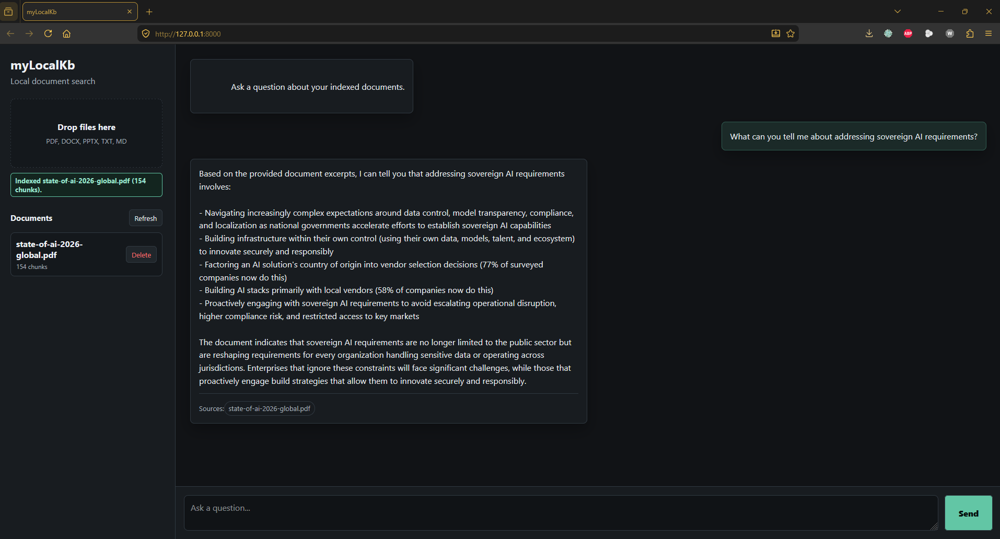

# myLocalKb

myLocalKb is an offline, local-only personal knowledge base with a browser chat interface. It lets you upload documents, index them locally, and ask grounded questions against your own files using local embeddings, a local vector database, and a local LLM served by Ollama.

No cloud LLM APIs are used. No API keys are required. Uploaded documents, embeddings, and vector indexes stay on your machine.



---

## Project Status

**Early alpha / local prototype.** The core offline upload, retrieval, and chat flow is working, but the app is still being hardened for broader public use. Expect rough edges, especially around installation environments, parser quality, and large-document performance.

---

## Why This Exists

Most RAG-style knowledge-base tools rely on hosted LLMs, hosted embedding APIs, telemetry, or managed vector databases. myLocalKb is intentionally small and local:

- Local FastAPI backend
- Local Ollama chat model
- Local Ollama embedding model
- Local ChromaDB vector store
- Vanilla HTML/CSS/JS frontend
- No build step for the UI

---

## Features

- Upload PDF, DOCX, PPTX, TXT, and Markdown files
- Parse, chunk, embed, and store documents locally
- Ask questions through a browser chat UI
- Retrieve relevant document chunks using ChromaDB
- Generate answers with a local Ollama model
- Refuse answers when retrieved context is insufficient
- Show a deduplicated source list below each answer
- Keep runtime data under `data/`, which is gitignored

---

## Privacy And Offline Model

After the one-time dependency/model setup:

- The app runs on `127.0.0.1`
- Documents are stored under `data/documents/`
- Vector data is stored under `data/chroma_db/`
- Ollama serves models locally through `localhost:11434`
- No OpenAI, Anthropic, Gemini, Cohere, Pinecone, Weaviate Cloud, or other cloud SDK is used

Model downloads are handled by Ollama during setup. Model weights are not stored in this repository.

---

## Tech Stack

| Layer | Choice |
|---|---|
| Backend | FastAPI, Uvicorn |
| Frontend | Vanilla HTML/CSS/JS |
| Chat LLM | `qwen3:4b` via Ollama |
| Embeddings | `nomic-embed-text` via Ollama |
| Vector store | ChromaDB persistent local store |
| Parsers | pypdf, python-docx, python-pptx, built-in text parsing |

---

## Quick Start

### Prerequisites

- Python 3.11 or 3.12 recommended
- [Ollama](https://ollama.com/download)
- About 4 GB free disk space for the default models

### Setup

```bash
git clone https://github.com/apg6390/myLocalKb.git
cd myLocalKb
```

macOS / Linux:

```bash
bash setup.sh
```

Windows PowerShell:

```powershell
.\setup.bat
```

The setup script installs Python dependencies and pulls:

- `qwen3:4b`
- `nomic-embed-text`

### Run

See [RUNNING.md](RUNNING.md) for the day-to-day startup commands.

Windows PowerShell example:

```powershell
cd path\to\myLocalKb

# Window 1
ollama serve

# Window 2
python -m uvicorn backend.main:app --host 127.0.0.1 --port 8000
```

Then open:

```text
http://127.0.0.1:8000
```

---

## Hardware Requirements

| Configuration | RAM | Disk |
|---|---:|---:|
| Default (`qwen3:4b`) | 8 GB | ~3 GB for models |
| Higher quality (`qwen3:8b`) | 16 GB | ~5.5 GB for models |
| Low-RAM (`phi3:mini`) | 4 GB | ~2.5 GB for models |

To switch models, edit `config.yaml`:

```yaml
llm:
  model: qwen3:8b
```

Then pull the selected model with Ollama:

```bash
ollama pull qwen3:8b
```

---

## Usage

### Add Documents

1. Open `http://127.0.0.1:8000`
2. Drag and drop a supported file, or click the upload area
3. Wait for the upload/indexing status to complete
4. Confirm the document appears in the sidebar

Supported formats:

- `.pdf`
- `.docx`
- `.pptx`
- `.txt`
- `.md`

### Ask Questions

Type a question into the chat input and press **Send**.

The assistant will:

1. Embed the question locally
2. Retrieve relevant chunks from ChromaDB
3. Ask the local LLM to answer only from those chunks
4. Show source filenames below the answer

If the retrieved context is insufficient, it should respond:

```text
I could not find relevant information in the knowledge base.
```

---

## Anti-Hallucination Behavior

The LLM prompt requires answers to use only retrieved excerpts. The backend also enforces source metadata. This does not make the system perfect, but it gives the app a conservative default behavior:

- Empty context returns a fixed "not found" response
- The model is instructed to answer only from excerpts
- Source filenames are returned separately by the API
- The UI deduplicates displayed source names

---

## Configuration

All runtime settings live in `config.yaml`:

```yaml
llm:
  model: qwen3:4b
  base_url: http://localhost:11434
  temperature: 0.1
  max_tokens: 2048

embeddings:
  model: nomic-embed-text
  base_url: http://localhost:11434

retrieval:
  chunk_size: 512
  chunk_overlap: 64
  top_k: 5
```

---

## Development

Install dependencies:

```bash
python -m pip install -r requirements.txt
```

Run tests:

```bash
python -m pytest tests -v
```

The repository includes a GitHub Actions workflow at [.github/workflows/tests.yml](.github/workflows/tests.yml).

---

## Project Structure

```text
myLocalKb/
|-- backend/        Python FastAPI backend
|-- frontend/       HTML/CSS/JS web interface
|-- data/           Runtime documents and vector DB, gitignored
|-- docs/           Architecture notes and setup guide
|-- tests/          pytest test suite
|-- RUNNING.md      Day-to-day startup guide
|-- config.yaml     Runtime configuration
`-- requirements.txt
```

---

## Known Limitations

- This is an early alpha, not a production-grade document management system.
- OCR for scanned/image-only PDFs is not implemented.
- Parser quality varies by file type and document layout.
- Very large documents may take time to parse, embed, and store.
- Model quality depends on the selected Ollama model and local hardware.
- The app is designed for single-user local use, not multi-user hosting.

---

## Legal And Attribution Notes

- Project code is licensed under the Apache License 2.0. See [LICENSE](LICENSE).
- Third-party Python dependencies, tools, and model references are documented in [THIRD_PARTY_LICENSES.md](THIRD_PARTY_LICENSES.md).
- Ollama is not bundled with this repository. Users install it separately.
- Model weights are not redistributed in this repository. Users download models through Ollama and are responsible for complying with each model's license.
- Uploaded documents are user-provided content. Users are responsible for ensuring they have the right to process and store the files they upload.
- The included screenshot is for project demonstration only. Do not publish screenshots containing third-party document excerpts unless you have the right to share them.

---

## Related Documentation

- [Running the app](RUNNING.md)
- [Setup guide](docs/setup.md)
- [Architecture](docs/architecture.md)
- [LLM choice ADR](docs/adr/001-llm-choice.md)
- [Third-party licenses](THIRD_PARTY_LICENSES.md)
